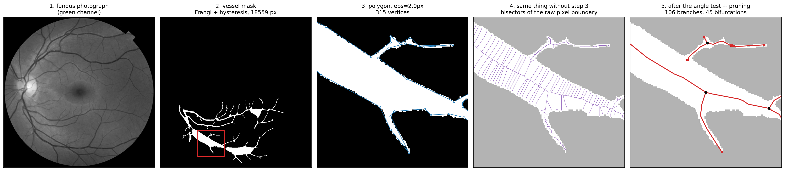
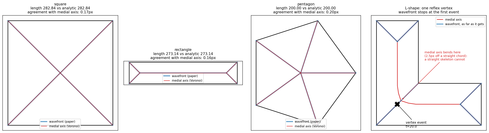
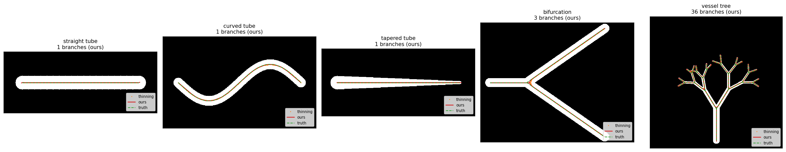
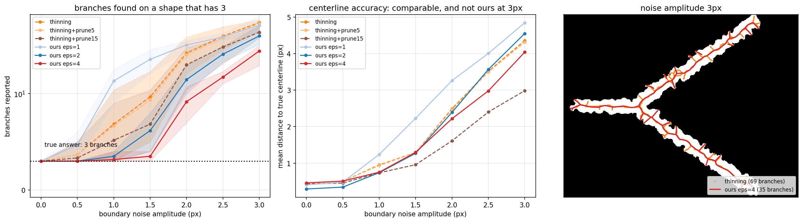
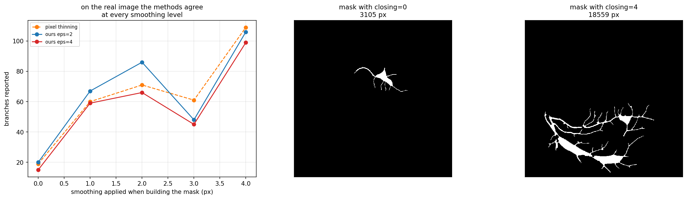
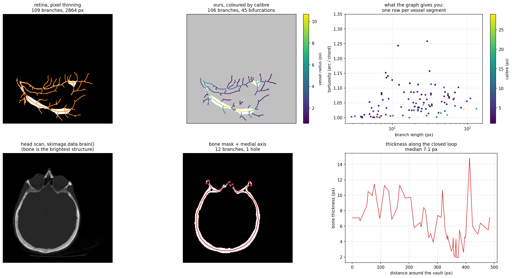
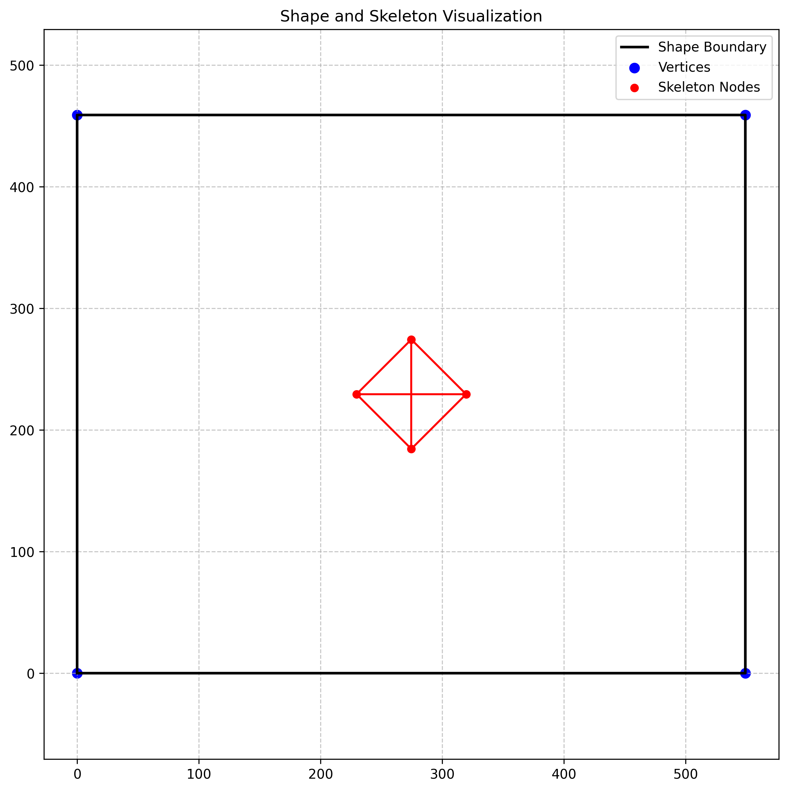
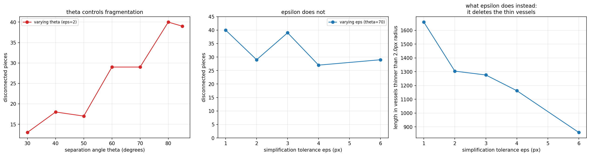

# medskel — implementing and testing a bisector skeletonization method

An implementation of the skeletonization method proposed by [Saidou, Zineddine
and Rhazzaf (2024)](docs/saidou-et-al-2024-a-novel-method-of-skeletonization-of-complex-shapes-based-on-bisectors.pdf),
applied to 2D medical segmentations, with an evaluation against the standard
pixel-thinning baseline.

**The short version of what I found:** the method is correct, and I can validate
it exactly against answers computed by hand. It reports fewer spurious branches
than pixel thinning on synthetic shapes whose boundary I deliberately roughen.
But that advantage **does not reproduce on the real image I tested** — there the
two methods agree to within a few percent — and it costs about 66× the runtime.
The write-up below is mostly the evidence for those three sentences, including
two measurement errors of my own that I had to correct along the way.

Nourddin Saidou teaches at my university and suggested I implement the paper,
which is how this started.

---

## What a skeleton is, and why a medical image would want one

Segment a blood vessel and you get a binary mask: a blob of pixels. The
clinically useful quantities are not properties of the blob. How long a vessel
segment is, how wide, how tortuous, how many times it branches — these are all
properties of a curve running down the middle of it. Retinal vessel calibre and
tortuosity are tracked as markers in diabetic and hypertensive retinopathy.

That middle curve is the **skeleton**, or **centerline**, or **medial axis**.
Formally it is the set of points equidistant from two different parts of the
outline.

This is old and standard — it goes back to Blum in 1967, and `scikit-image` has
had `morphology.skeletonize()` for years. The paper is not proposing the goal.
It proposes a different route to it.

## The method

Pixel thinning shaves the mask inward until a one-pixel-wide line remains, so
the roughness of the boundary directly shapes the skeleton. The paper's idea is
to convert the boundary to a **simplified polygon first**, then compute the
skeleton from that polygon, so smoothing happens before the skeleton exists
rather than as spur-deletion afterwards.



For the skeleton itself the paper proves that where two boundary segments meet
the skeleton is their angle bisector, and between two parallel segments it is
the median line. Both say: the skeleton is the locus of points equidistant from
two pieces of boundary. That locus is what a **Voronoi diagram** of densely
sampled boundary points produces — every Voronoi edge is by construction the
perpendicular bisector of a pair of boundary samples, and the interior ones
converge to the medial axis (Brandt & Algazi 1992, Attali & Montanvert 1997).

Panel 4 above shows why the polygon step exists: run the same construction on
the raw pixel boundary and every staircase corner spawns its own bisector, so
you get a comb of hairs. What survives on the simplified polygon is filtered by
the **separation angle** — at a candidate point, measure the angle between the
two boundary points it is equidistant from. A true medial axis point sees them
in roughly opposite directions (wide angle); a hair is generated by two
adjacent samples (angle near zero). Threshold at 70°.

Three parameters:

| knob | job |
|---|---|
| `epsilon` | polygon simplification tolerance in px. The regularization. |
| `theta_deg` | separation angle. Removes hairs. |
| `prune` | drops a leaf branch shorter than `prune ×` the local radius. Scale-adaptive. |

## Validation: does my code compute what it claims to?

This is the part I trust most. The paper's own construction is a wavefront —
shrink the polygon inward at constant speed, and each time an edge collapses to
nothing that is a skeleton node. I implemented that separately in
[`medskel/bisector.py`](medskel/bisector.py) as an independent check on the
Voronoi version.



For a square, a rectangle and a regular pentagon the total skeleton length can
be worked out on paper. The wavefront implementation matches those values with
a difference of **0.0e+00**, and the two independent implementations agree with
each other to within 0.2 px, which is the boundary sampling step. Two different
constructions of the same definition landing on the same number is the
strongest evidence in the repo.

**Where the paper's construction stops.** Shrinking a polygon has two kinds of
event: an edge collapses (easy), or the wavefront pinches itself in two and the
loop must be cut and rejoined (hard). I implemented only the first, so on any
concave shape `propagate()` halts and names the event rather than producing
something wrong.

**A discrepancy in the paper worth stating.** The wavefront construction
produces only straight segments — it builds the *straight skeleton*, which is a
different object from the medial axis the paper defines via maximal disks. They
coincide for convex polygons and diverge at reflex vertices, because there the
nearest boundary feature is a point rather than an edge, and the locus
equidistant from a point and a line is a parabola. Measured on an L-shape, the
medial axis branch nearest the reflex corner departs 2.5 px from a straight
chord over a 57 px span; a straight skeleton has zero departure by
construction. Every vessel bifurcation is a reflex corner, so the two
definitions disagree exactly where a vessel tree is interesting.

## Accuracy: both methods are sub-pixel, and they tie

Phantoms where the centerline is drawn first and the shape grown around it, so
the answer is known before anything runs.



| phantom | method | mean err | p95 err | coverage | branches (true) | time |
|---|---|---|---|---|---|---|
| straight tube | thinning | 0.19 px | 0.38 px | 100% | 1 (1) | 0.00 s |
| straight tube | ours | 0.23 px | 0.38 px | 100% | 1 (1) | 0.09 s |
| curved tube | thinning | 0.46 px | 1.09 px | 100% | 1 (1) | 0.00 s |
| curved tube | ours | 0.49 px | 1.05 px | 100% | 1 (1) | 0.19 s |
| tapered tube | thinning | 0.17 px | 0.32 px | 100% | 1 (1) | 0.00 s |
| tapered tube | ours | 0.22 px | 0.33 px | 100% | 1 (1) | 0.06 s |
| bifurcation | thinning | 0.43 px | 0.64 px | 98% | 3 (3) | 0.00 s |
| bifurcation | ours | 0.29 px | 0.61 px | 100% | 3 (3) | 0.18 s |
| vessel tree | thinning | 0.49 px | 1.22 px | 100% | 36 (31) | 0.01 s |
| vessel tree | ours | 0.52 px | 1.35 px | 100% | 36 (31) | 0.44 s |

On clean shapes there is **no advantage whatsoever**. Same accuracy to within
0.05 px, identical branch counts, and this method is 25–75× slower. An earlier
version of this table claimed thinning reported 8 branches for the Y and 91 for
the tree; that was a bug in my counting, described under "What broke".

## Noise: where the advantage actually is

Take the Y phantom (3 branches), add correlated noise to its boundary only — so
the mask stays one blob with a wobbly edge, which is what a segmentation error
looks like — and count branches.



Branches reported, mean over 6 seeds. True answer is 3:

| boundary noise | thinning | thinning + spur pruning | ours ε=2 | ours ε=4 |
|---|---|---|---|---|
| 0.0 px | 3.0 | 3.0 | 3.0 | 3.0 |
| 1.0 px | 6.8 | 5.2 | 3.5 | 3.2 |
| 2.0 px | 29.3 | 21.5 | 14.5 | 9.2 |
| 3.0 px | 66.0 | 51.0 | 46.2 | 31.0 |

This is a genuine effect: at 2 px of boundary noise, thinning with spur pruning
reports 21.5 branches against 9.2 for this method with ε=4, so roughly 2.3×
fewer false branches. Two qualifications that belong next to it:

- **ε has to be chosen well.** At ε=1 the method is *worse* than thinning
  (14.0 against 6.8 at 1 px of noise). This is a property of choosing enough
  simplification, not of the method being inherently better.
- **Accuracy goes the other way at high noise.** At 3 px, thinning with
  aggressive pruning has the lowest centerline error of anything here, 2.98 px
  against 4.04 px for ε=4, because discarding all the spurs leaves only the
  well-centered core. It buys accuracy by discarding structure.

## Does the advantage transfer to a real image? No.

The noise result above is a fact about that phantom. Whether it is a fact about
medical images is a separate question, and the answer here is no.

The vessel mask is built with a morphological closing that smooths the boundary
before the skeletonizer ever sees it. So I rebuilt the mask at five smoothing
levels, from none to the default, and compared:



| closing | mask px | thinning | ours ε=2 | ours ε=4 |
|---|---|---|---|---|
| 0 | 3105 | 19 | 20 | 15 |
| 1 | 4743 | 60 | 67 | 59 |
| 2 | 8267 | 71 | 86 | 66 |
| 3 | 13217 | 61 | 48 | 45 |
| 4 | 18559 | 109 | 106 | 99 |

The methods agree at every setting, and at ε=2 this one is sometimes slightly
worse. The gap measured on the phantom does not appear.

Two caveats, in both directions. There is **no ground truth** on a fundus
image, so agreeing on ~106 branches does not mean either method is right, only
that they agree — unlike the phantom, where "3" is a fact. And this is **one
image and one segmentation pipeline**, which is evidence, not proof. Settling
it would need an annotated dataset such as DRIVE or STARE.

## The real images, descriptively



**Retina.** 106 branches and 45 bifurcations, against 109 branches and 53
junctions from thinning. Total skeleton length 2914 px, median vessel calibre
4.2 px, median tortuosity 1.04. Each branch carries its own length, radius and
tortuosity, which is the scatter plot on the right — one row per vessel
segment. Runtime 0.66 s against 0.0099 s for thinning, so **66× slower**.

On storage, both skeletons converted to polylines and simplified at the *same*
tolerance: 381 points against 321 at 1 px tolerance, a 1.19× difference. At
0.25 px it looks like 2.7×, but that is measuring the pixel grid rather than
the method — a pixel skeleton is a staircase and was never accurate to better
than half a pixel, so demanding sub-pixel fidelity of it forces every step to
be stored. An earlier version of this README claimed 5×, and up to 134× on
phantoms, by comparing my simplified polylines against thinning's raw pixel
count. That was not a like-for-like comparison and the claim is withdrawn.

**Skull.** A different shape class. The vault is an annulus, so its medial axis
closes into a loop rather than terminating in free ends — the mask has a hole
and the skeleton has a cycle. (The six endpoints in this skeleton are in the
facial bones, not on the vault loop; on a clean synthetic ring the endpoint
count is exactly zero, which is one of the tests.) The clearance radius stored
at every node is half the local bone thickness, so the bottom-right panel is a
bone-thickness profile around the vault, median 7.1 px, with nothing extra
written to obtain it.

## What broke

Kept in the repo rather than tidied away, because they are the most useful part.

**1. The original attempt (early 2025).**



Wrong in two independent ways. The rectangle is the image border — the loader
thresholded a dark blob on a white background and kept the *bright* side, so it
was skeletonizing the background. And the diamond is what you get from
intersecting the bisectors of every pair of vertices simultaneously, where the
paper says to intersect neighbouring bisectors and take the pair that meets
first, then repeat. There is no propagation in it. Code in [`legacy/`](legacy/).

**2. Two wavefront bugs that produced plausible rubbish rather than crashing.**
A merge that removed the wrong element when the collapsing edge was last in the
list, and simultaneous events leaving zero-length edges that were then skipped
as "already happened". Together they placed a skeleton node at (180, −140) on a
polygon that stops at y = 0. Both now have regression tests against
hand-computed lengths.

**3. Two measurement errors that inflated my own results.** These are the
serious ones, because unlike the others they made the method look good.

*Branch counting.* Three lines cannot meet at a point on a pixel grid, so
thinning leaves a knot of a few mutually adjacent pixels at each junction. My
counter read each knot as several one-pixel branches. On a clean Y it reported
8 branches for a 3-branch shape, with all 5 extras being 1 px long and stacked
at the single junction. That inflated the baseline's count everywhere: the
headline noise comparison read 84 against 9 when the honest numbers are 29
against 9, the clean-phantom "advantage" vanished entirely once fixed, and the
retina gap went from 314-vs-106 to 109-vs-106. `merge_junction_clusters()` in
[`medskel/baseline.py`](medskel/baseline.py) now contracts each knot to one
junction, and `count_pixel_branches(merge_junctions=False)` reproduces the old
behaviour so the size of the artefact stays visible.

*Storage.* I compared my RDP-simplified polylines against thinning's raw pixel
count and reported 10× to 134×. That measures my simplification step against
the baseline's lack of one. Simplifying both at the same tolerance, the ratio
is 1.1–1.2× at any sensible tolerance.

I found the first of these because someone looked at my figure and said they
could not see the spurs I claimed were there. They were right.

## Limitations

- **The advantage is unproven on real data.** Demonstrated on synthetic
  phantoms with added boundary noise; did not reproduce on the one real image
  tested. Nothing here is validated against expert annotation.
- **It is 66× slower** than thinning on the retina image.
- **The skeleton graph fragments** — 29 pieces on a mask that is one connected
  component, because the separation angle thresholds each vertex independently
  with nothing protecting connectivity. An earlier version hid this by keeping
  only the largest piece, discarding 22% of total vessel length.
- **Centeredness is slightly worse** than thinning, 0.81 against 0.85 on the
  retina, and about 1.7% of sampled points round onto a boundary pixel.
- **The wavefront implementation handles edge events only**, so in practice
  convex polygons. It is a validation tool, not the working method.
- **The segmentations are not good** and are not the point. The Frangi vessel
  mask merges adjacent vessels near the optic disc; the skull mask needs a
  hand-picked percentile.
- **2D only.**

## Running it

```bash
pip install -r requirements.txt
```

```bash
python -m pytest tests -q
```

14 tests, each checking against a value worked out by hand rather than against
whatever the code did last time. Then any experiment — each writes a figure to
`figures/` and its numbers to `results/`:

```bash
python experiments/01_pipeline.py
```

Both images are scikit-image samples: `retina()` ships with the package,
`brain()` is fetched once by pooch.

```python
from medskel import skeletonize

skel = skeletonize(mask, epsilon=2.0, prune=1.0)
print(skel.n_branches(), skel.n_bifurcations(), skel.total_length())

for row in skel.branch_table():
    print(row["length"], row["mean_radius"], row["tortuosity"])
```

Layout: [`medskel/`](medskel/) is the library (`polygon` → `voronoi` → graph,
`bisector` for the paper's own method, `baseline` for thinning, plus `metrics`,
`phantoms`, `data`); [`experiments/`](experiments/) reproduces every figure;
[`legacy/`](legacy/) is the broken first attempt.

## What I would do next

The honest state is that this method matches pixel thinning on the data I have,
and the case for it rests on a synthetic noise model I wrote myself. So the
first thing to do is not to improve the method — it is to find out whether the
noise regime where it wins ever actually occurs. That means an annotated
dataset, DRIVE or STARE, where "how many vessels are there" has an answer a
human wrote down. With ground truth you can ask the question that matters:
across a range of segmentation qualities, is there a regime where this method
recovers the annotated branch count better than thinning does? My synthetic
result predicts there should be one at rough boundaries. The retina result
suggests boundaries that rough may not occur once a normal segmentation
pipeline has applied its own smoothing. Those are distinguishable, and until
they are distinguished the method has no demonstrated use.

The concrete engineering problem, meanwhile, is the fragmentation, and
[`experiments/06_knobs.py`](experiments/06_knobs.py) already narrows it down.
I assumed the simplification tolerance was cutting thin vessels, and I was
wrong: sweeping θ from 30° to 85° moves the component count from 13 to 40,
while sweeping ε from 1 to 6 px leaves it flat between 27 and 40. What ε does
instead is delete thin vessels, dropping sub-2px-radius length from 1659 px to
859 px.



So the fix belongs in θ, and the specific thing I would try is to stop
thresholding vertices independently: keep the whole interior bisector network
and extract a maximum spanning tree weighted by separation angle, which yields
one connected skeleton per connected mask by construction and turns θ from a
hard cut into a ranking. That is falsifiable — the component count should go to
1, and if the noise numbers degrade at the same time then the hard threshold
was doing real work and the idea is wrong.

The other direction is 3D, which is where this would need to go to be useful
for volumetric imaging. The Voronoi construction generalizes directly to a
medial *surface*, but reducing a medial surface to a curve skeleton for a
tubular structure is a genuinely different problem, not a port of this code.

## References

- N. Saidou, M. Zineddine, M. Rhazzaf. *A Novel Method of Skeletonization of
  Complex Shapes Based on Bisectors.* Computing Open, Vol. 2, 2024.
  [PDF](docs/saidou-et-al-2024-a-novel-method-of-skeletonization-of-complex-shapes-based-on-bisectors.pdf) (CC BY 4.0)
- H. Blum. *A transformation for extracting new descriptors of shape.* 1967.
- R. Brandt, V. Algazi. *Continuous skeleton computation by Voronoi diagram.*
  CVGIP: Image Understanding, 1992.
- D. Attali, A. Montanvert. *Computing and simplifying 2D and 3D continuous
  skeletons.* CVIU, 1997.
- O. Aichholzer, F. Aurenhammer, D. Alberts, B. Gärtner. *A novel type of
  skeleton for polygons.* J. Universal Computer Science, 1995.
- Images from `skimage.data.retina()` and `skimage.data.brain()`.
